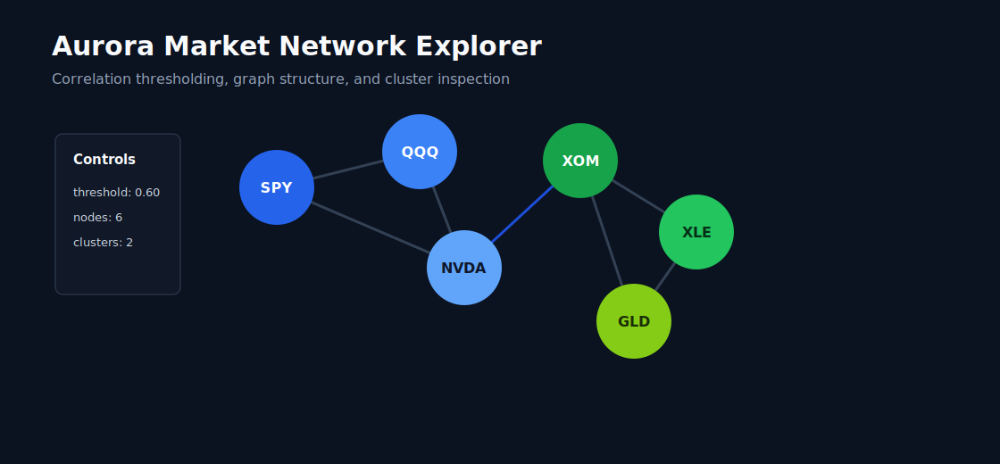
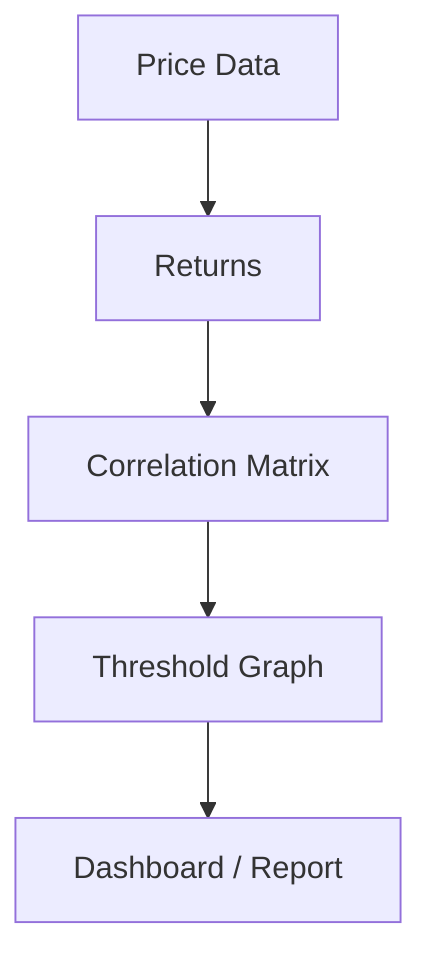

# Aurora Market Network Explorer


## Overview

Aurora is a Streamlit dashboard for exploring equity correlation networks, sector structure, threshold-based graph behavior, and market clustering. The project turns a correlation matrix into an inspectable network view where nodes represent assets and edges represent relationships above a selected threshold. It is designed for visualization and research, not trading recommendations. Public examples can run on safe sample data without credentials.

## Why It Matters

Correlation structure affects diversification, risk concentration, and market stress behavior. A network view can reveal clusters, isolated assets, and highly connected market components faster than a raw matrix. Aurora gives users an interactive way to inspect those relationships while keeping the analysis transparent.

## Core Features

- Ticker universe selection
- Correlation matrix workflow
- Threshold-based network graph
- Sector clustering notes
- Threshold slider concept
- Node details and simple graph metrics
- Export/reporting roadmap

## Architecture





```text
aurora-market-network-explorer/
  app.py
  src/aurora/
    data.py
    graph.py
    metrics.py
    ui.py
  examples/
  screenshots/
  docs/
  tests/
```

## Tech Stack

- Python 3.10+
- Streamlit
- pandas, NumPy
- networkx
- Plotly or matplotlib
- yfinance or safe sample data

## Review Docs

- [Network methodology](docs/network_methodology.md)
- [Example analysis](docs/example_analysis.md)
- [Architecture](docs/architecture.md)
- [Recruiter brief](docs/recruiter_brief.md)

## Quickstart

```bash
git clone https://github.com/shawsignaldev/aurora-market-network-explorer.git
cd aurora-market-network-explorer
python -m venv .venv
source .venv/bin/activate
pip install -r requirements.txt
pip install -e .
streamlit run app.py
```

Windows:

```powershell
git clone https://github.com/shawsignaldev/aurora-market-network-explorer.git
cd aurora-market-network-explorer
python -m venv .venv
.venv\Scripts\activate
pip install -r requirements.txt
pip install -e .
streamlit run app.py
```

## Example Analysis

| Threshold | Nodes | Edges | Interpretation |
| --- | ---: | ---: | --- |
| `0.30` | 6 | 8 | Broad connected market structure |
| `0.60` | 6 | 3 | Stronger sector clusters remain |
| `0.80` | 6 | 1 | Only the tightest relationship survives |

## Screenshots

Screenshots are intentionally omitted until sanitized visuals are available. See `screenshots/README.md`.

## Project Status

Active research/build project. Public repository focuses on architecture, documentation, examples, and selected safe components.

## Roadmap

- Add live yfinance adapter with sample-data fallback
- Add Plotly network visualization
- Add exportable correlation reports
- Add sector metadata and clustering labels
- Add dashboard screenshots

## Disclaimer

This repository is for educational and research purposes only. It is not financial advice, investment advice, or a recommendation to buy or sell any security. Trading involves risk, including possible loss of capital.
