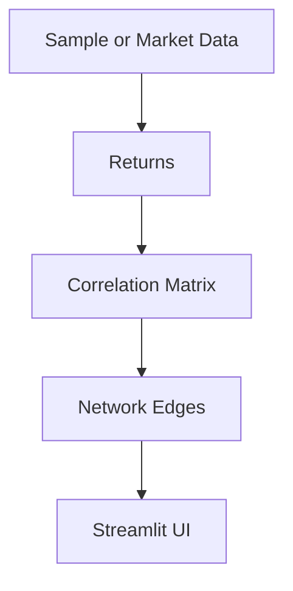

# Architecture

```mermaid
graph TD
  A[Sample or Market Data] --> B[Returns]
  B --> C[Correlation Matrix]
  C --> D[Network Edges]
  D --> E[Streamlit UI]
```

Aurora is built around a transparent pipeline from price data to returns, correlation, thresholded graph structure, and dashboard output.

